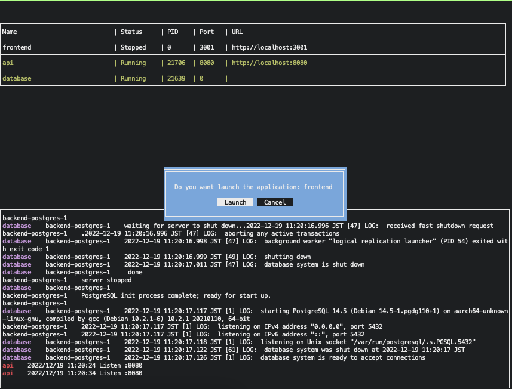

# appman

A TUI tools that simple process manager for developers.



# Install

```shell
$ go install github.com/mrtc0/appman
```

# Example Configuration

```yaml
- name: "frontend"
  path: "/path/to/frontend"
  startCommand: ["npm", "run", "start"]
  port: 3000
  url: "http://localhost:3000"

- name: "api"
  path: "/path/to/backend"
  startCommand: ["go", "run", "main.go"]
  port: 5600
  url: "http://localhost:5600"

- name: "database"
  path: "/path/to/backend"
  startCommand: ["docker", "compose", "up"]
  stopCommand: ["docker", "compose", "down"]
```

